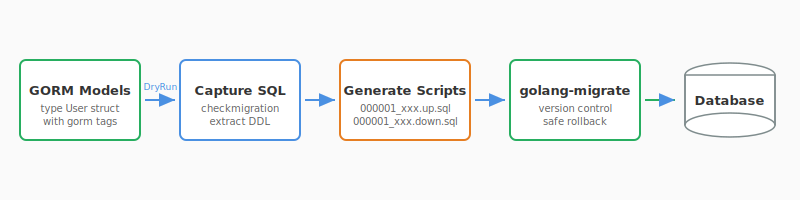
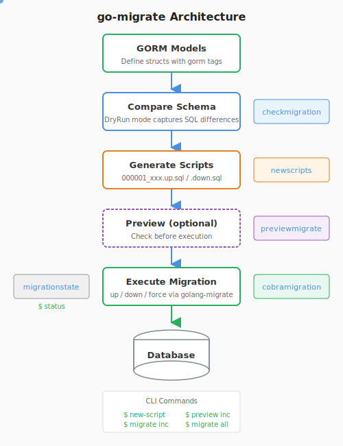

[](https://github.com/go-xlan/go-migrate/actions/workflows/release.yml?query=branch%3Amain)
[](https://pkg.go.dev/github.com/go-xlan/go-migrate)
[](https://coveralls.io/github/go-xlan/go-migrate?branch=main)
[](https://go.dev/)
[](https://github.com/go-xlan/go-migrate/releases)
[](https://goreportcard.com/report/github.com/go-xlan/go-migrate)

# go-migrate

Intelligent database migration toolkit with GORM struct integration and automated script generation.

---

## Ecosystem





<!-- TEMPLATE (EN) BEGIN: LANGUAGE NAVIGATION -->

## CHINESE README

[中文说明](README.zh.md)
<!-- TEMPLATE (EN) END: LANGUAGE NAVIGATION -->

## Features

- **Smart Schema Analysis**: Auto-compare GORM models with existing database schemas
- **Automated Script Generation**: Create migration scripts with intelligent version management
- **Safe Operations**: DryRun mode and preview to ensure secure migrations
- **Multi-Database Support**: Works with MySQL, PostgreSQL, SQLite through golang-migrate
- **Comprehensive CLI**: Intuitive Cobra commands covering all migration operations
- **Status Inspection**: Check database version, pending migrations and schema differences

## Core Packages

| Package          | Purpose                                                    |
|------------------|------------------------------------------------------------|
| `checkmigration` | Compare GORM models with database, capture SQL differences |
| `newmigrate`     | Create golang-migrate instance                             |
| `migrationparam` | Migration connection management and debug mode settings    |
| `newscripts`     | Generate next version migration scripts                    |
| `cobramigration` | Cobra CLI commands (up/down/force)                         |
| `previewmigrate` | Preview migrations before execution                        |
| `migrationstate` | Check migration status                                     |

## Installation

```bash
go get github.com/go-xlan/go-migrate
```

## Quick Start

### 1. Define GORM Models

```go
type User struct {
    ID   uint   `gorm:"primarykey"`
    Name string `gorm:"size:100"`
    Age  int
}
```

### 2. Setup CLI Program

```go
package main

import (
    "github.com/go-xlan/go-migrate/cobramigration"
    "github.com/go-xlan/go-migrate/migrationparam"
    "github.com/go-xlan/go-migrate/migrationstate"
    "github.com/go-xlan/go-migrate/newmigrate"
    "github.com/go-xlan/go-migrate/newscripts"
    "github.com/go-xlan/go-migrate/previewmigrate"
    "github.com/golang-migrate/migrate/v4"
    mysqlmigrate "github.com/golang-migrate/migrate/v4/database/mysql"
    "github.com/spf13/cobra"
    "github.com/yyle88/must"
    "github.com/yyle88/rese"
    "gorm.io/gorm"
)

func main() {
    scriptsPath := "./scripts"

    // MigrationParam with lazy initialization and unified resource management
    param := migrationparam.NewMigrationParam(
        func() *gorm.DB {
            return setupYourDatabase() // Your GORM setup
        },
        func(db *gorm.DB) *migrate.Migrate {
            sqlDB := rese.P1(db.DB())
            driver := rese.V1(mysqlmigrate.WithInstance(sqlDB, &mysqlmigrate.Config{}))
            return rese.P1(newmigrate.NewWithScriptsAndDatabase(&newmigrate.ScriptsAndDatabaseParam{
                ScriptsInRoot:    scriptsPath,
                DatabaseName:     "mysql",
                DatabaseInstance: driver,
            }))
        },
    )

    objects := []any{
        &User{},
        &Product{},
        &Cart{},
    }

    rootCmd := &cobra.Command{Use: "app"}
    rootCmd.AddCommand(newscripts.NewScriptCmd(&newscripts.Config{
        Param:   param,
        Options: newscripts.NewOptions(scriptsPath),
        Objects: objects,
    }))
    rootCmd.AddCommand(cobramigration.NewMigrateCmd(param))
    rootCmd.AddCommand(previewmigrate.NewPreviewCmd(param, scriptsPath))
    rootCmd.AddCommand(migrationstate.NewStatusCmd(&migrationstate.Config{
        Param:       param,
        ScriptsPath: scriptsPath,
        Objects:     objects,
    }))

    must.Done(rootCmd.Execute())
}
```

### 3. Common Workflow

```bash
# Step 1: Check current status
go run main.go status

# Step 2: Update GORM model (add field, change type, etc.)

# Step 3: Generate migration script
go run main.go new-script
# Creates: scripts/000001_xxx.up.sql and scripts/000001_xxx.down.sql

# Step 4: Preview pending execution
go run main.go preview inc

# Step 5: Execute migration
go run main.go migrate inc    # One step
go run main.go migrate all    # All pending
```

## CLI Commands

| Command | Description |
|---------|-------------|
| `status` | Show database version, pending migrations, schema diff |
| `new-script` | Generate migration scripts based on schema changes |
| `preview inc` | Preview next migration without executing |
| `migrate inc` | Execute next migration |
| `migrate dec` | Rollback one migration |
| `migrate all` | Execute all pending migrations |
| `migrate force N` | Force set version to N |

## Database Support

Works with MySQL, PostgreSQL, SQLite through golang-migrate drivers:

```go
// MySQL
import mysqlmigrate "github.com/golang-migrate/migrate/v4/database/mysql"
driver := rese.V1(mysqlmigrate.WithInstance(sqlDB, &mysqlmigrate.Config{}))

// PostgreSQL
import postgresmigrate "github.com/golang-migrate/migrate/v4/database/postgres"
driver := rese.V1(postgresmigrate.WithInstance(sqlDB, &postgresmigrate.Config{}))

// SQLite
import sqlite3migrate "github.com/golang-migrate/migrate/v4/database/sqlite3"
driver := rese.V1(sqlite3migrate.WithInstance(sqlDB, &sqlite3migrate.Config{}))
```

## Advanced Configuration

### Debug Mode

Enable debug mode to see detailed SQL capture and migration analysis output:

```go
import "github.com/go-xlan/go-migrate/migrationparam"

// Enable debug mode for migration operations
migrationparam.SetDebugMode(true)

// Check current debug mode status
if migrationparam.GetDebugMode() {
    // Debug logging is enabled
}
```

### Embedded Migrations

```go
//go:embed migrations
var migrationsFS embed.FS

migration := rese.V1(newmigrate.NewWithEmbedFsAndDatabase(&newmigrate.EmbedFsAndDatabaseParam{
    MigrationsFS:     &migrationsFS,
    EmbedDirName:     "migrations",
    DatabaseName:     "mysql",
    DatabaseInstance: driver,
}))
```

### Custom Script Naming

```go
naming := &newscripts.ScriptNaming{
    NewScriptPrefix: func(version uint) string {
        return fmt.Sprintf("%d_%s", version, description)
    },
}
```

### Migration Options

```go
options := newscripts.NewOptions("./scripts").
    WithDryRun(true).
    WithSurveyWritten(true)
```

## Examples

See [internal/demos/](internal/demos) with complete working examples:

- [demo1x](internal/demos/demo1x): MySQL integration with Makefile commands
- [demo2x](internal/demos/demo2x): PostgreSQL integration with Makefile commands

```bash
cd internal/demos/demo1x
make STATUS              # Check status
make CREATE-SCRIPT-CREATE-TABLE  # Generate scripts
make MIGRATE-PREVIEW-INC # Preview
make MIGRATE-ALL         # Execute
```

<!-- TEMPLATE (EN) BEGIN: STANDARD PROJECT FOOTER -->
<!-- VERSION 2025-11-25 03:52:28.131064 +0000 UTC -->

## 📄 License

MIT License - see [LICENSE](LICENSE).

---

## 💬 Contact & Feedback

Contributions are welcome! Report bugs, suggest features, and contribute code:

- 🐛 **Mistake reports?** Open an issue on GitHub with reproduction steps
- 💡 **Fresh ideas?** Create an issue to discuss
- 📖 **Documentation confusing?** Report it so we can improve
- 🚀 **Need new features?** Share the use cases to help us understand requirements
- ⚡ **Performance issue?** Help us optimize through reporting slow operations
- 🔧 **Configuration problem?** Ask questions about complex setups
- 📢 **Follow project progress?** Watch the repo to get new releases and features
- 🌟 **Success stories?** Share how this package improved the workflow
- 💬 **Feedback?** We welcome suggestions and comments

---

## 🔧 Development

New code contributions, follow this process:

1. **Fork**: Fork the repo on GitHub (using the webpage UI).
2. **Clone**: Clone the forked project (`git clone https://github.com/yourname/repo-name.git`).
3. **Navigate**: Navigate to the cloned project (`cd repo-name`)
4. **Branch**: Create a feature branch (`git checkout -b feature/xxx`).
5. **Code**: Implement the changes with comprehensive tests
6. **Testing**: (Golang project) Ensure tests pass (`go test ./...`) and follow Go code style conventions
7. **Documentation**: Update documentation to support client-facing changes
8. **Stage**: Stage changes (`git add .`)
9. **Commit**: Commit changes (`git commit -m "Add feature xxx"`) ensuring backward compatible code
10. **Push**: Push to the branch (`git push origin feature/xxx`).
11. **PR**: Open a merge request on GitHub (on the GitHub webpage) with detailed description.

Please ensure tests pass and include relevant documentation updates.

---

## 🌟 Support

Welcome to contribute to this project via submitting merge requests and reporting issues.

**Project Support:**

- ⭐ **Give GitHub stars** if this project helps you
- 🤝 **Share with teammates** and (golang) programming friends
- 📝 **Write tech blogs** about development tools and workflows - we provide content writing support
- 🌟 **Join the ecosystem** - committed to supporting open source and the (golang) development scene

**Have Fun Coding with this package!** 🎉🎉🎉

<!-- TEMPLATE (EN) END: STANDARD PROJECT FOOTER -->

---

## GitHub Stars

[](https://starchart.cc/go-xlan/go-migrate)
